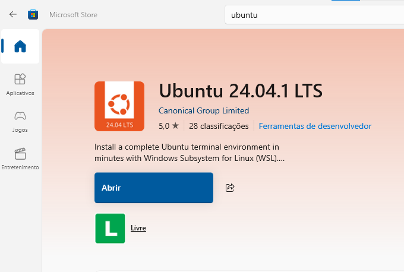
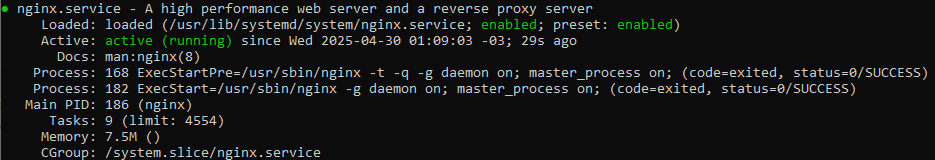
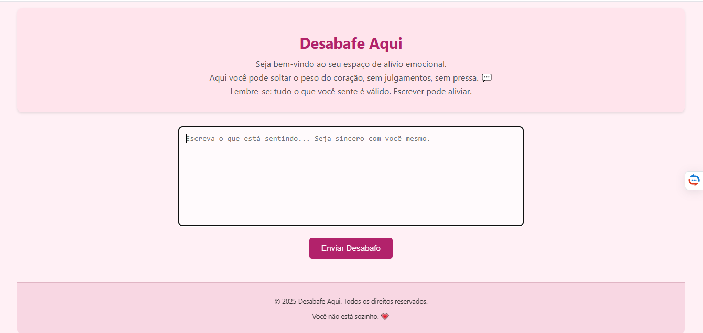
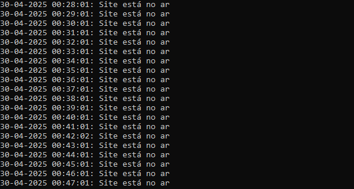
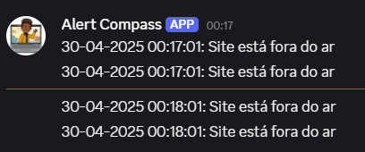

<h1>📊 Monitoramento de um servidor web com Nginx e Webhook 🚀</h1>

Este projeto tem como objetivo monitorar se um site está no ar e, caso não esteja, enviar uma mensagem de alerta para o <strong>Discord</strong>, <strong>Slack</strong> ou <strong>Telegram</strong> usando Webhooks. O monitoramento é feito a cada 1 minuto.

<h2>📋 Etapa Inicial - Visão Geral das Etapas</h2>

O processo será dividido nas seguintes etapas:

<ol>
    <li><strong>Etapa 1:</strong> Montar o ambiente local (VM ou Subsystems).</li>
    <li><strong>Etapa 2:</strong> Subir o servidor Nginx.</li>
    <li><strong>Etapa 2.5:</strong> Montar um site simples.</li>
    <li><strong>Etapa 3:</strong> Criar o script de verificação de site e integração com Webhooks.</li>
    <li><strong>Etapa 3.5:</strong> Configurar log para monitoramento com informações de status.</li>
    <li><strong>Etapa 4:</strong> Testar a integração do Webhook.</li>
    <li><strong>Etapa 5:</strong> Agendar a execução do script a cada 1 minuto.</li>
</ol>

<h2>🚀 Etapa 1 - Montar Ambiente Local (VM ou Subsystems)</h2>
<ol>
    <li><strong>Instalar o Ubuntu pela Microsoft Store</strong>:
        
Abra a Microsoft Store, busque por "Ubuntu" e instale a versão desejada.

    </li>
</ol>

<ol>
    <li><strong>Instalar o WSL (Windows Subsystem for Linux)</strong>:
        <pre>wsl --install -d Ubuntu</pre>
    </li>
    <li><strong>Abrir o Ubuntu no terminal</strong>:
        <pre>wsl </pre>
    </li>
</ol>

<h2>🚀 Etapa 2 - Subir Servidor Nginx</h2>
<ol>
    <li><strong>Instalar o Nginx</strong>:
        <pre>sudo apt-get update</pre>
        <pre>sudo apt-get install nginx</pre>
    </li>
   <li><strong>Após instalar o Nginx</strong>
      
Execute o comando <pre>systemctl status nginx</pre> em seu terminal e deve aparecer a seguinte mensagem

     
    </li>
    <li><strong>Iniciar o Nginx</strong>:
        <pre>sudo systemctl start nginx</pre>
    </li>
    <li><strong>Verificar se o Nginx está funcionando</strong>: Acesse <a href="http://localhost">http://localhost</a> ou o IP da máquina.</li>
</ol>

<h2>🌐 Etapa 2.5 - Montar um Site</h2>
<ol>
    <li><strong>Criar o arquivo index.html</strong> no diretório <pre>/var/www/html/</pre></li>
    
Encontrará um arquivo chamado index.html

</ol>    

## meu Site modelo

<h2>🕵️‍♂️ Etapa 3 - Script de Verificação</h2>
<ol>
    <li><strong>Criar o script monitoramento.sh</strong>:
        <pre>nano /home/usuario/monitoramento.sh</pre>
    </li>
    <li><strong>Exemplo de script</strong>:
        <pre>
#!/bin/bash

discordkey="SEU-WEBHOOK-URL"
log="/var/log/monitoramento.log"
data=$(date "+%d-%m %H:%M:%S")

if systemctl is-active nginx; then
    mensagem="$data : Site está no ar"
else
    mensagem="$data : Site está fora do ar"
    curl -H "Content-Type: application/json" -X POST -d "{\"content\":\"$mensagem\"}" "$discordkey"
fi

echo "$mensagem" | tee -a "$log"
        </pre>
    </li>
  </pre>
    </li>
    <li><strong>Tornar o script executável</strong>:
        <pre>chmod +x /home/usuario/monitoramento.sh</pre>
    </li>
</ol>

<h2>🧠 O que cada parte faz:</h2>
<ul>
  <li><code>#!/bin/bash</code> — Define que o script será interpretado pelo Bash (linguagem de terminal).</li>

  <li><code>discordkey="SEU-WEBHOOK-URL"</code> — Aqui você define a URL do webhook do Discord para onde será enviada a mensagem de alerta.</li>

  <li><code>log="/var/log/monitoramento.log"</code> — Define o local onde será salvo o log com as mensagens do monitoramento.</li>

  <li><code>data=$(date "+%d-%m %H:%M:%S")</code> — Cria uma variável com a data e hora atuais no formato: dia-mês hora:minuto:segundo.</li>

  <li><code>if systemctl is-active nginx; then</code> — Verifica se o serviço do Nginx está ativo (ou seja, se o site está no ar).</li>

  <li><code>mensagem="$data : Site está no ar"</code> — Se o Nginx estiver ativo, a mensagem vai indicar que o site está no ar.</li>

  <li><code>else</code> — Se o Nginx <strong>não</strong> estiver ativo:</li>
  <ul>
    <li><code>mensagem="$data : Site está fora do ar"</code> — A mensagem indicará que o site está fora do ar.</li>
    <li><code>curl ...</code> — Envia essa mensagem para o canal do Discord via webhook, no formato JSON.</li>
  </ul>

  <li><code>echo "$mensagem" | tee -a "$log"</code> — Exibe a mensagem no terminal <strong>e</strong> salva no arquivo de log (sem apagar o conteúdo anterior).</li>
</ul>

<h2>📜 Etapa 3.5 - Log com Informações de Status</h2>
<ol>
    <li><strong>Configurar o Log</strong> para gravar a data, hora e status (se está no ar ou não). O log será salvo em <pre>/var/log/monitoramento.log.</pre></li>
    <li><strong>Visualizar o log em tempo real</strong>:
        <pre>tail -f /var/log/verifica.log</pre>
    </li>
</ol>

   

<h2>⚡ Etapa 4 - Testar o Webhook</h2>
<ol>
    <li><strong>Criar Webhook no Discord</strong>: Vá para Configurações do Servidor > Integrações > Webhooks e crie um Webhook.</li>
</ol>
 
<ol>    
    <li><strong>Testar o Webhook</strong>:
        <pre>/home/usuario/monitoramento.sh</pre>
        
Verifique se a mensagem de alerta chega no Discord.

    </li>
</ol>
 

<h2>🕐 Etapa 5 - Agendar a Execução do Script a Cada 1 Minuto</h2>
<ol>
    <li><strong>Abrir o cron para editar</strong>:
        <pre>crontab -e</pre>
    </li>
    <li><strong>Adicionar a linha para rodar o script a cada 1 minuto</strong>:
        <pre>* * * * * /home/usuario/monitoramento.sh</pre>
    </li>
    <li><strong>Salvar e sair</strong> (pressione Ctrl + O, depois Enter, e Ctrl + X).</li>
</ol>

<h2>🎉 Pronto! Agora seu site está sendo monitorado automaticamente!</h2>

A cada 1 minuto, o script verifica se o site está no ar e envia alertas via Webhook quando necessário.

<h2>📄 Licença</h2>

Este projeto está licenciado sob os termos da <strong>MIT License</strong>.

